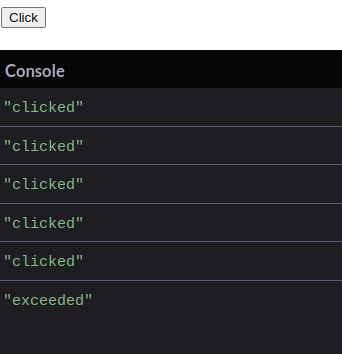

# DOM (Document Object Model)

The Document Object Model (DOM) is a fundamental concept in web development that allows developers to interact with and manipulate the structure, content, and styling of web documents. Understanding the DOM is crucial for creating dynamic, interactive web pages. In this blog, we'll explore what the DOM is, how it works, and some common techniques for working with it.

## What is the DOM?

The DOM is a programming interface for web documents. It represents the structure of a document as a tree of objects, where each object corresponds to a part of the document. In the context of an HTML document, the DOM provides a way to access and manipulate HTML elements, attributes, and text.

When a web page is loaded, the browser parses the HTML and CSS to create the DOM. This tree-like structure allows developers to traverse the document, access elements, and modify them, which in turn updates the visual representation of the page in the browser.

## How DOM Works (Understanding Real DOM)

- **Real DOM:** The Document Object Model (DOM) is a tree structure representing the HTML elements of a webpage. It allows JavaScript to manipulate content, structure, and styling dynamically.
- **Rendering:** The browser parses HTML, CSS, and JavaScript to construct the DOM and render the webpage. Any changes to the DOM can trigger reflows (layout recalculations) and repaints, which are performance-intensive operations.
- **DOM Manipulation:** JavaScript can modify the DOM by adding, removing, or altering elements. However, frequent DOM manipulation can slow down the page due to the need for re-rendering.

## The DOM Tree Structure

The DOM represents the document as a hierarchical tree of nodes. Here's a breakdown of the different types of nodes:

- Document Node: The top-level node representing the entire document.
- Element Nodes: Represent HTML elements such as `<div>, <p>, and <a>`. Each element node can have child nodes.
- Attribute Nodes: Represent the attributes of HTML elements, such as class, id, and href. These nodes are not children of element nodes but are accessed via the element.
- Text Nodes: Represent the text content within an element. Text nodes are always leaf nodes in the DOM tree (i.e., they do not have child nodes).
  For example, consider the following HTML:

```
html
Copy code
<!DOCTYPE html>
<html>
  <head>
    <title>Sample Page</title>
  </head>
  <body>
    <h1>Hello, World!</h1>
    <p>This is a paragraph.</p>
  </body>
</html>
```

The corresponding DOM tree would look like this:

```
Document
│
├── html
│   ├── head
│   │   └── title (Sample Page)
│   └── body
│       ├── h1 (Hello, World!)
│       └── p (This is a paragraph.)
```

## Understanding DOM Traversal

DOM traversal refers to navigating through the DOM tree. JavaScript provides properties to traverse the DOM:

- **parentNode:** Access the parent node of an element.
- **childNodes:** Access the child nodes of an element.
- **firstChild and lastChild:** Access the first and last child of an element.
- **nextSibling and previousSibling:** Access the next and previous sibling of an element.

## DOM Traversal Using Query Methods, Parent, Sibling, etc.

- `document.querySelector()`: Selects the first element that matches a specified CSS selector.
- `document.querySelectorAll()`: Selects all elements that match a specified CSS selector.
- `element.parentElement`: Gets the parent of the selected element.
- `element.children`: Retrieves all child elements of a selected element.
- `element.firstElementChild`: Gets the first child element of the selected element.
- `element.lastElementChild`: Gets the last child element of the selected element.
- `element.nextElementSibling`: Gets the next sibling element.
- `element.previousElementSibling`: Gets the previous sibling element.
- `element.closest()`: Finds the closest ancestor element that matches a specified selector.
  **example**:

```js
const firstParagraph = document.querySelector("p");
const parent = firstParagraph.parentElement;
const nextSibling = firstParagraph.nextElementSibling;
const closestDiv = firstParagraph.closest("div");
```

## Accessing the DOM

JavaScript provides several methods to access and manipulate the DOM. Here are some commonly used methods:

- `document.getElementById(id)`: Selects an element by its id.
- `document.getElementsByClassName(className)`: Selects all elements with a given class name.
- `document.getElementsByTagName(tagName)`: Selects all elements with a given tag name.
- `document.querySelector(selector)`: Selects the first element that matches a CSS selector.
- `document.querySelectorAll(selector)`: Selects all elements that match a CSS selector.

## Manipulating the DOM

Once we've accessed a DOM element, we can manipulate it in various ways:

Changing Content: We can change the text content of an element using element.textContent or element.innerHTML for HTML content.

```js
document.getElementById("myElement").textContent = "New Content";
```

Modifying Attributes: We can get or set attributes using element.getAttribute(attributeName) and element.setAttribute(attributeName, value)

```js
document.querySelector("a").setAttribute("href", "https://example.com");
```

Adding/Removing Classes: Use element.classList.add('className') to add a class or element.classList.remove('className') to remove a class.

```js
document.querySelector(".myClass").classList.add("newClass");
```

Creating and Inserting Elements: We can create new elements using document.createElement(tagName) and insert them into the DOM using methods like appendChild, insertBefore, or replaceChild.

```js
const newElement = document.createElement("div");
newElement.textContent = "Hello!";
document.body.appendChild(newElement);
```

## Event Handling

The DOM also allows us to handle user interactions through events. We can attach event listeners to elements to execute code when an event occurs (e.g., a click, hover, or keypress).

```js
document.getElementById("myButton").addEventListener("click", function () {
  alert("Button clicked!");
});
```

## How do you remove event listeners from an element?

- by using the method `removeEventListener().

  ;
  ;
  ;

## Adding and Removing Event Listeners

**Adding Event Listeners:**

- Use the `addEventListener()` method, which allows you to attach multiple event handlers to an element.
- The preferred way is to use `addEventListener()` because it allows for better control and flexibility, including options like once, capture, and passive.

```js
const button = document.querySelector("button");
button.addEventListener("click", () => {
  console.log("Button clicked");
});
```

**Removing Event Listeners:**

- Use the `removeEventListener()` method. You need to pass the same function reference that was used to add the event listener.

```js
function handleClick() {
  console.log("Button clicked");
}
button.addEventListener("click", handleClick);
button.removeEventListener("click", handleClick);
```

## Event bubbling

- Event Bubbling is the default mode of event propagation in most browsers. When an event occurs on a particular element, it first triggers the event on that element itself. Then, the event bubbles up to its parent elements, and each parent element has the opportunity to handle the event before it reaches the root of the DOM tree.

```html
<div id="outer">
  <div id="inner">Click me</div>
</div>
```

- If you click on the `<div id="inner">`, the event will first be handled by the inner div, and then it will bubble up to the outer div.

```js
document.getElementById("outer").addEventListener("click", function () {
  console.log("Outer div clicked");
});

document.getElementById("inner").addEventListener("click", function () {
  console.log("Inner div clicked");
});
```

- If you click on the inner div, you will see the log "Inner div clicked" followed by "Outer div clicked".

## Event capturing

- Event Capturing, also known as event capturing or the capturing phase, is less commonly used but works in the opposite direction to bubbling. The event starts at the top of the DOM tree and travels down to the target element. It allows you to handle events before they reach the target element.

- Continuing with the same HTML structure, you can set up event capturing like this:

```js
document.getElementById("outer").addEventListener(
  "click",
  function () {
    console.log("Outer div clicked in capturing phase");
  },
  true
); // `true` indicates capturing phase

document.getElementById("inner").addEventListener("click", function () {
  console.log("Inner div clicked");
});
```

- In this case, if you click on the inner div, you will first see "Outer div clicked in capturing phase" and then "Inner div clicked."

## Event Delegation

**Event Delegation:** A technique where a single event listener is added to a parent element to manage events for multiple child elements. This leverages event bubbling to reduce the number of event listeners.

```js
document.querySelector("#parent").addEventListener("click", function (event) {
  if (event.target.matches(".child")) {
    console.log("Child element clicked:", event.target.textContent);
  }
});
```

## Why Adding a Lot of Event Listeners is Bad for the App

- **Performance Impact:** Each event listener consumes memory and CPU resources. Adding many event listeners can lead to higher memory usage and slow down the application, especially during frequent DOM updates.
- **Complexity:** Managing many event listeners can make the code harder to maintain and debug.
- **Potential for Memory Leaks:** If event listeners are not properly removed, they can cause memory leaks, especially when DOM elements are removed but their listeners remain in memory.

## What are the different types of events available?

1. **Mouse Events**

- **click**: Triggered when a mouse button is clicked on an element.
- **dblclick**: Triggered when an element is double-clicked.
- **mousedown**: Triggered when a mouse button is pressed down.
- **mouseup**: Triggered when a mouse button is released.
- **mousemove**: Triggered when the mouse pointer is moved.
- **mouseover**: Triggered when the mouse pointer enters an element.
- **mouseout**: Triggered when the mouse pointer leaves an element.
- **mouseenter**: Triggered when the mouse pointer enters an element (does not bubble).
- **mouseleave**: Triggered when the mouse pointer leaves an element (does not bubble).

2. **Keyboard Events**

- **keydown**: Triggered when a key is pressed down.
- **keyup**: Triggered when a key is released.
- **keypress**: Triggered when a key is pressed down and held (deprecated in modern web development).

3. **Form Events**

- **submit**: Triggered when a form is submitted.
- **reset**: Triggered when a form is reset.
- **change**: Triggered when the value of an input, select, or textarea element changes.
- **input**: Triggered when the value of an input or textarea element changes (more real-time than change).
- **focus**: Triggered when an element receives focus.
- **blur**: Triggered when an element loses focus.
- **select**: Triggered when text within an input or textarea is selected.

4. **Window Events**

- **load**: Triggered when the whole page (including all dependent resources) has finished loading.
- **resize**: Triggered when the window is resized.
- **scroll**: Triggered when the page or an element is scrolled.
- **unload**: Triggered when the document or window is being unloaded (less commonly used).
- **beforeunload**: Triggered before the window or document is unloaded, often used to show a confirmation dialog.

5. **Touch Events (for mobile devices)**

- **touchstart**: Triggered when a touch point is placed on the touch surface.
- **touchend**: Triggered when a touch point is removed from the touch surface.
- **touchmove**: Triggered when a touch point is moved along the touch surface.
- **touchcancel**: Triggered when a touch event is interrupted (e.g., by an incoming call).

6. **Drag Events**

- **drag**: Triggered when an element is being dragged.
- **dragstart**: Triggered when the user starts dragging an element.
- **dragend**: Triggered when the user stops dragging an element.
- **dragover**: Triggered when an element is dragged over a valid drop target.
- **dragenter**: Triggered when a dragged element enters a valid drop target.
- **dragleave**: Triggered when a dragged element leaves a valid drop target.
- **drop**: Triggered when a dragged element is dropped on a valid drop target.

7. **Clipboard Events**

- **copy**: Triggered when the user copies content to the clipboard.
- **cut**: Triggered when the user cuts content to the clipboard.
- **paste**: Triggered when the user pastes content from the clipboard.

8. **Media Events**

- **play**: Triggered when media (e.g., audio or video) starts playing.
- **pause**: Triggered when media is paused.
- **ended**: Triggered when media playback ends.
- **volumechange**: Triggered when the volume of media changes.
- **timeupdate**: Triggered when the playback position of media changes.

9. **Animation and Transition Events**

- **animationstart**: Triggered when a CSS animation starts.
- **animationend**: Triggered when a CSS animation ends.
- **animationiteration**: Triggered when a CSS animation iteration completes.
- **transitionend**: Triggered when a CSS transition ends.

10. **Other Events**

- **error**: Triggered when an error occurs while loading an external resource (e.g., an image fails to load).
- **contextmenu**: Triggered when the context menu (usually the right-click menu) is opened.
